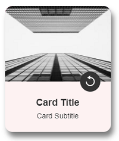
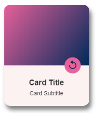
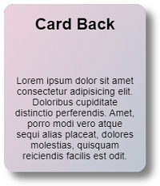

# Custom Element \<card-two-zones>

"Flippable" card.
___






## Attributes
### top: set height as % of top container
A number in range ]0, 1]. Default to 2/3 of height specified in light DOM CSS.


## Slots
### 4 Front side slots
* front-top-slot: image displayed at the top. No default image. When none provided, the background-color defined by ```--bg-front-top``` will be used.
* icon: flip icon displayed on the button. Default to an svg icon as illustrated in screenshot.
* front-bottom-title: bottom div title.
* front-bottom-subtitle: bottom div subtitle.

### 1 Back side slot
* back-content: content of card's back side.


## Component Styling CSS with CSS Variables


--bg-back: background color of whole div (back). Defaults to: #eee;

--bg-front-bottom: background color of bottom div (front). Defaults to #eee.


--bg-front-top: background-color of top div (front). Defaults to: #eee.


--flip-duration: flip animation duration. Defaults to: 0.8s;


--btn-flip-bg: background-color of flip button. Defaults to: #595775.


--flip-icon-fill: stroke & fill color of flip icon. Defaults to: #fff.


--font-family: applicable on :host. Ddefaults to: sans-serif.


--rounded: card border radius. Defaults to: 0px.


--shadow-color: color of shadow. Defaults to: rgba(0, 0, 0, 0.5).


width & height of card set on light DOM. Note: width & height of top and bottom div of card's front side are set in JS based on  these values (by default top is 2/3 of total height, can be overriden through attribute 'top')

## Example
```html
<!-- import JS file -->
<script src="card-two-zones.js"></script>

<body>
  <card-two-zones top=0.6>
    <!-- if image used START -->
    
    <!-- if image used END -->
    <h3 slot="front-bottom-title">Card Title</h3>
    <p slot="front-bottom-subtitle">Card Subtitle</p>
    <div slot="back-content" id="back-content">
      <h2>Card Back</h2>
      <p>Lorem ipsum dolor sit amet consectetur adipisicing elit. Doloribus cupiditate distinctio perferendis. Amet, porro modi vero atque sequi alias placeat, dolores molestias, quisquam reiciendis facilis est odit.</p>
    </div>
  </card-two-zones>
</body>
```


```css

/* Component Styling */

 card-two-zones {
  width: 210px;
  height: 250px;
  --bg-back: #eee;
  --bg-front-bottom: #fdf2f2;
  /* if background (no image) START */
  --bg-front-top: linear-gradient(126deg, rgba(231, 97, 155, 1) 0%, rgba(0, 42, 90, 1) 100%);
  /* if background (no image) END */
  --btn-flip-bg: #333;
  --flip-duration: 0.8s;
  --flip-icon-fill: #fff;
  --font-family: arial;
  --rounded: 15px;
  --shadow-color: rgba(0, 0, 0, 0.5);
}

/* Slots Styling */

card-two-zones h3 {
  line-height: 2;
}

card-two-zones p {
  font-size: .9rem;
}

card-two-zones #back-content {
  background: linear-gradient(126deg, rgba(231, 97, 155, 0.2) 0%, rgba(0, 42, 90, 0.2) 100%);
  display: flex;
  flex-direction: column;
  justify-content: space-between;
  padding: 1rem;
  height: 100%;
  text-align: center;
  border-radius: 15px;
}
```