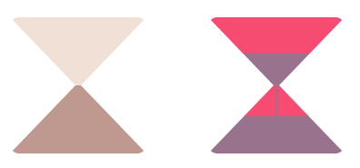

# Custom Element \<ye-hour-glass>

An Hourglass component reflecting remaining time.
Can be static or animated.

___





## Attributes
**bgColor**: background color ('glass color')
* type: String
* default: "#aba6bf"

**bgColorOver**: background color ('glass color') when time is over
* type: String
* default: "#f1e0d6"

**sandColor**:
* type: String
* default: "#595775"

**sandColorOver**: sand color when time is over
* type: String
* default: "#bf988f"

**timeleft**:
* type: Number
* required: true
* allowed range: [0, 1] - values are clamped.


## Component Styling - CSS

Component **dimensions** must be set from parent
```css
hour-glass {
  width: 150px;
  height: 150px;
}
```
**width** is the value used by the component to set the 'glass' (background) and sand positions.

**height** must be equal to width;


## Usage

**static**

```html
<ye-hour-glass
  timeleft="0.4"
  bgColor="#f64c72"
  bgColorOver="pink"
  sandColor="#99738e"
  sandColorOver="red"></ye-hour-glass>
```

**dynamic**

```html
<ye-hour-glass></ye-hour-glass>
```

```js
const hourGlass = document.querySelector('hour-glass');
const startTime = Date.now();
const endTime = startTime + 10000;
const totalTime = endTime - startTime;
const interval = setInterval(() => {
  const remaining = (endTime - Date.now()) / totalTime;
  if (remaining > 0) {
    hourGlass.setAttribute('timeleft', remaining);
  } else {
    hourGlass.setAttribute('timeleft', 0);
    clearInterval(interval);
  }
}, 1000);
```


## Demo
Available on https://codepen.io/sipann/pen/eYOarBj
